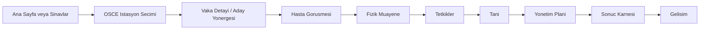
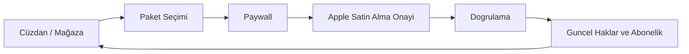

# PratiCase - Mevcut Ürün ve Ekran Tasarım Brifi

> Tarih: 26 Mayis 2026
>
> Kaynak: Mevcut Flutter/Dart uygulama kodu, canli veri sozlesmeleri ve README
>
> Kullanim amaci: Yeni mobil ekran tasarimlari uretecek tasarimci veya gorsel uretim modeli icin urun baglami
>
> Kapsam notu: Bu dokuman tasarim brifidir; uygulama kodunu, navigasyonu veya backend'i degistirmez.

## 1. Bu Dokumanin Temel Kurali

Yeni tasarimlar uygulamanin kokundeki eski ekran gorselleri, Stitch export ekran goruntuleri veya hayali demo icerikleri baz alinarak uretilmeyecektir. Kaynak gercek, mevcut koddur:

- UI amaci ve metinleri Flutter ekranlarindan alinacaktir.
- Veri alanlari domain modellerinden ve repository sozlesmelerinden alinacaktir.
- Klinik vaka icerigi Supabase migration seed verileri ve OSCE modelinden alinacaktir.
- Magaza, abonelik ve cuzdan icerigi yeni `store` feature kodundan alinacaktir.
- Tasarim gorselleri yeni uretilmelidir; eski raster mockup'larin stilini kopyalama zorunlulugu yoktur.
- Uygulamada bulunmayan paket adi, istatistik, kampanya, klinik sonuc veya yetenek uydurulmayacaktir.

## 2. Önemli Güncel Durum: Vakalar ve Mağaza

Ürün kararı: **Ana navigasyonda eski `Vakalar` odağı kaldırılmış kabul edilecek; yeni tasarım çalışmasında ikinci ana alan Cüzdan/Mağaza olacaktır.**

Mevcut kaynak kodda dikkat edilmesi gereken teknik ayrim vardir:

- Yeni ve kapsamli `WalletScreen`, `PaywallScreen` ve `SubscriptionStatusScreen` kodlanmistir.
- `WalletScreen`; Medasi Coin bakiyesi, soru hakki, aktif abonelik, paketler ve islem gecmisini sunar.
- Bununla birlikte mevcut `PratiCaseShell` kaynak kodunda ikinci bottom navigation hedefi halen `CasesScreen` ve etiketi halen `Vakalar` olarak gorunmektedir.
- Profil menusundeki `Magaza` su anda eski `StoreScreen` rotasina, `Premium Abonelik` ise yeni abonelik yonetim ekranina acilmaktadir.

Tasarim icin yorum:

- Yeni ana sekme tasarımı `Cüzdan` veya `Mağaza` ekseninde hazırlanmalıdır; eski `Vakalar` sekmesi yeni ana navigasyon görseli olarak tasarlanmamalıdır.
- OSCE vakalari urunden silinmis degildir. Vaka secimi, istasyon baslatma ve vaka cozme akisi `Sinavlar` ve `Ana Sayfa` uzerinden erisilen klinik alt akis olarak korunur.
- Koddaki navigasyon baglantisinin daha sonra bu urun kararina gore hizalanmasi ayri bir implementasyon isidir.

## 3. Urun Ozeti

### 3.1. PratiCase nedir?

PratiCase, Medasi ekosistemindeki iPhone-oncelikli klinik performans ve sinav simulasyonu uygulamasidir. Temel hedef kitlesi tip ogrencileri ve klinik pratik yapan kullanicilardir.

PratiCase bir soru bankasi veya salt icerik okuma uygulamasi degildir. Uygulamanin cekirdegi sudur:

> Kullanici bir sinav ortamina girer, klinik kararlar alir, cevap verir, performansi olculur ve sonunda yapilandirilmis karne alir.

### 3.2. Mevcut urun yetenekleri

Kod tabaninda bulunan ana deneyimler:

1. E-posta tabanli kayit, giris, dogrulama, sifre yenileme ve profil kurulumu.
2. OSCE klinik istasyonu: sanal hasta, anamnez, fizik muayene, tetkik, tani, yonetim ve rubrik karne.
3. Sozlu sinav: tek moderator veya uc hocali komite formati, sesli/yazili yanit ve ayri karne.
4. Teorik sinav: Medasi soru havuzundan ders/konu secimi, soru cozumu ve ilerleme senkronu.
5. Gelisim alani: klinik beceri skorlarinin, sonuclarin, zayif alanlarin, rozetlerin ve siralamanin izlenmesi.
6. Cuzdan ve magaza: Medasi Coin, soru hakki, abonelik, paket satin alma, App Store dogrulama ve islem gecmisi.
7. Profil ve ayarlar: hesap, bildirimler, destek, kullanici verisi ve cikis akisi.

### 3.3. Platform ve sistem baglami

| Alan | Mevcut durum |
| --- | --- |
| Uygulama teknolojisi | Flutter / Dart, Material 3 |
| Onceleme hedefi | iPhone, mobil-first deneyim |
| Backend | Supabase Auth, PostgREST, Edge Functions |
| Klinik AI akisleri | `praticase-patient-turn`, `praticase-complete-session` |
| Sinav genislemeleri | Teorik sinav ve sozlu sinav modulleri |
| Satin alma | StoreKit, `praticase-storekit-verify` Edge Function |
| Ortak ekosistem | Medasi; ortak profil ve cuzdan haklari |
| Web hedefi | `praticase.medasi.com.tr` |

## 4. Marka ve Tasarim Karakteri

### 4.1. Marka duygusu

PratiCase tasarimi:

- Klinik ve akademik olarak guvenilir hissettirmeli.
- Premium ama gosterissiz olmali.
- Gercek sinav konsantrasyonunu desteklemeli.
- Hasta ve ogrenci deneyimine saygili olmali.
- Finansal ekranlarda ciddi ve acik, sinav ekranlarinda odakli olmali.

Kacinilacak yonler:

- Robot, beyin, devre, neon teknoloji veya yapay zeka klisesi.
- Genel landing page kahraman alani gibi urun disi pazarlama kompozisyonlari.
- Gercek kodda bulunmayan promosyonlar, paketler veya skorlar.
- Klinik ekranda dikkat dagitan dekoratif illüstrasyon yogunlugu.

### 4.2. Mevcut renk sistemi

Kodda tanimli marka renkleri:

| Token | Renk | Kullanim duygusu |
| --- | --- | --- |
| `navy` | `#0B1D2A` | Guven, basliklar, sinav ciddiyeti |
| `teal` | `#0E7C78` | Ana aksiyon, secili durum, klinik marka |
| `tealBright` | `#32C8BF` | Kucuk canli vurgu, koyu yuzeyde highlight |
| `gold` | `#F2A900` | Premium, uyari, basari veya rozet vurgusu |
| `softSurface` | `#F5F6F7` | Uygulama zemini |
| `white` | `#FFFFFF` | Kart ve form yuzeyi |
| `ink` | `#17212B` | Govde metni |
| `muted` | `#5C6873` | Ikincil bilgi |
| `border` | `#E2E6EA` | Yumusak cerceve |
| `gradientStart` | `#063443` | Hero/cuzdan koyu gradient baslangici |
| `gradientEnd` | `#006A72` | Hero/cuzdan koyu gradient sonu |

### 4.3. Bilesen karakteri

Mevcut token ve tema niyeti:

- Plus Jakarta Sans yazı ailesi kullanilir.
- Sayfa zeminleri acik gri; ana kartlar beyazdir.
- Kart radius degerleri cogunlukla `18-28px` araligindadir.
- Ana butonlar teal/koyu teal ve yuvarlak kenarlidir.
- Premium veya ana odak yuzeylerinde lacivert-teal gradient kullanilir.
- Golgeler yumusak, dusuk opaklikli ve yuksek blur degerlidir.
- Mobilde buyuk dokunma hedefleri ve safe-area bosluklari korunur.

## 5. Navigasyon ve Urun Mimarisi

### 5.1. Tasarimda esas alinacak ana sekmeler

Urun kararina gore yeni tasarim setinde ana sekmeler su sekilde ele alinmalidir:

| Sekme | Amac | Ana icerik |
| --- | --- | --- |
| `Ana Sayfa` | Gunluk giris ve hizli yonlendirme | Karsilama, sinav baslatma, ilerleme ozeti, devam edilen aktivite |
| `Cüzdan` / `Mağaza` | Haklar ve satın alma merkezi | MC bakiyesi, soru hakkı, abonelik, paketler, işlemler |
| `Sinavlar` | Sinav turu secim merkezi | OSCE, Sozlu, Teorik ve hedefli tekrar |
| `Gelisim` | Performans analizi | Ortalama, beceri kirilimi, son trend, geri bildirim |
| `Profilim` | Hesap ve destek merkezi | Profil, ayarlar, bildirimler, magaza/abonelik kisayollari |

### 5.2. Klinik alt akis

`Vakalar` yeni ana navigasyon sekmesi olarak resmedilmese de OSCE simulasyon motorunun icinde gerekli bir alt akistir:



### 5.3. Satin alma alt akis



## 6. Kullanici Yolculuklari

### 6.1. Ilk giris

1. Kullanici onboarding ekraninda urun vaadini gorur.
2. `Basla` ile hesap olusturma akisina veya `Giris Yap` ile login ekranina gider.
3. E-posta dogrulamasi tamamlanir.
4. Profil kurulumu ve hedef secimi yapilir.
5. Kullanici uygulama shell'ine girer.

### 6.2. OSCE klinik istasyonu

1. Kullanici `Sinavlar` veya ana sayfadaki `Tek Istasyon` aksiyonundan istasyon secimine girer.
2. Vaka detayinda aday yonergesi, klinik ortam, zorluk ve sureyi gorur.
3. Oturum baslayinca sayac gorunur; sanal hasta acilis cumlesiyle baslar.
4. Kullanici anamnez icin hastayla yazarak veya desteklenen akista sesle konusur.
5. Fizik muayene secimleri ve sonuclari incelenir.
6. Tetkikler secilir; uygun veya gereksiz secimlerin degerlendirmeye etkisi vardir.
7. Kullanici on tani, ayirici tanilar ve klinik gerekceyi yazar.
8. Yonetim planini olusturur ve sinavi bitirir.
9. Rubrik tabanli karne ve gelisim onerileri gorulur.

### 6.3. Sozlu sinav

1. Kullanici `Sozlu Sinav` modulune girer.
2. `Tek Moderator` veya `Komite (3 Hoca)` formatini secer.
3. Hoca/persona, brans, vaka veya rastgele vaka ve sinav suresi secilir.
4. Sinav odasinda sorulara yazili veya sesli yanit verir.
5. Komite modunda baskan, yardimci ve gozlemci rolleri gorulebilir.
6. Sonda sozlu karne, hoca notlari, guclu yonler ve gelisim alanlari sunulur.

### 6.4. Teorik sinav

1. Kullanici dersleri ve varsa konulari secer.
2. Her ders icin soru sayisini belirler.
3. Medasi soru hakkini ve kullanilabilir tekrar etmeyen soru bilgisini gorur.
4. Deneme oturumunda sorulari cevaplar ve bitirir.
5. Sonuc skoru ile ilerleme senkron durumunu gorur.

### 6.5. Mağaza ve cüzdan

1. Kullanıcı `Cüzdan` ana sekmesinde mevcut MC bakiyesini ve soru hakkını görür.
2. Bakiye gizlenebilir veya gosterilebilir.
3. Aktif abonelik varsa ozet karti ve yonetim aksiyonu gorulur.
4. `MC Satin Al` veya `Paketleri Gor` ile paket/paywall ekranina gider.
5. Paket secimi yapilir; abonelik veya tek seferlik satin alma bilgisi acikca sunulur.
6. Satin alma App Store tarafindan onaylanir ve sunucu dogrulamasi sonrasinda haklar guncellenir.
7. Islem gecmisi, aktif/kullanildi/iade/suresi doldu durumlarini gosterebilir.

## 7. Tasarlanacak Birincil Ekran Seti

Yeni gorsel tasarim seti asagidaki ekranlari oncelemelidir. Her ekran yeni bir gorsel olarak uretilmeli; mevcut uygulama ekran goruntusu kopyalanmamalidir.

| No | Ekran | Oncelik | Gorsel hedef |
| ---: | --- | --- | --- |
| 01 | Onboarding | Yuksek | Klinik guven ve urun girisi |
| 02 | Giris Yap | Orta | Guvenli, sade kimlik dogrulama |
| 03 | Ana Sayfa | Yuksek | Gunluk calisma ve sinav girisi |
| 04 | Cüzdan / Mağaza Ana Sekmesi | En yüksek | Yeni ana navigasyon hedefi; haklar ve paketler |
| 05 | Premium Paywall | Yuksek | Satin alma secimi ve acik abonelik bilgisi |
| 06 | Sinavlar Merkezi | Yuksek | OSCE / Sozlu / Teorik mod secimi |
| 07 | OSCE Hasta Gorusmesi | Yuksek | Sureli ve odakli klinik sohbet |
| 08 | OSCE Tetkik / Tani / Yonetim | Yuksek | Klinik aksiyon karar ekranlari |
| 09 | OSCE Sonuc Karnesi | Yuksek | Rubrik performans ozeti |
| 10 | Sozlu Sinav Kurulumu ve Oda | Orta | Moderator/komite sinav atmosferi |
| 11 | Sozlu Sinav Karnesi | Orta | Kurul yorumu ve puanlar |
| 12 | Teorik Sinav Kurulumu ve Sonuc | Orta | Soru havuzu ve senkron ilerleme |
| 13 | Gelisim | Yuksek | Beceri skorlari ve trend |
| 14 | Profilim | Orta | Hesap, ayar ve destek merkezligi |

Tasarlanmayacak ana sekme:

- Eski `Vakalar` bottom-navigation ekrani, yeni ana navigasyon tasarimi olarak uretilmeyecektir.
- Gerekiyorsa `OSCE Istasyon Secimi` adi ile `Sinavlar` alt akisinin bir parcasi olarak tasarlanabilir.

## 8. Ekran Bazli Ayrintili Brif

### 8.1. Onboarding

**Kod kaynagi:** `lib/src/features/auth/presentation/screens/onboarding_screen.dart`

**Ekranin amaci:** Uygulamanin ilk temas noktasi. Kullaniciya PratiCase'in klinik sinav hazirligi urunu oldugunu anlatir ve hesap akisina sokar.

**Kodda mevcut ana metinler:**

- `PratiCase`
- `Klinik Akıl Yürütme Becerini Geliştir`
- `Gerçekçi vaka simülasyonları ile OSCE sınavlarına güvenle hazırlan.`
- `Başla`
- `Zaten bir hesabın var mı?`
- `Giriş Yap`

**Gorsel gereksinim:**

- Sakin, premium, ilk acilista guven veren tek odakli kompozisyon.
- Ana CTA ekranda kolay erisilebilir olmali.
- Medikal atmosfer soyut veya cihaz-temelli olabilir; robot/AI sembolu olmamalidir.
- iPhone safe area ve alt home indicator boslugu gorunur sekilde korunmalidir.

### 8.2. Kayit, Giris ve Profil Kurulumu

**Kod kaynaklari:** `lib/src/features/auth/presentation/`

**Ekranlar:**

- `LoginScreen`: e-posta ve sifre ile giris.
- `RegisterScreen`: ad, soyad, e-posta, sifre, sifre tekrari ve acik hukuki onay.
- `VerifyEmailScreen`: 6 haneli dogrulama.
- `ForgotPasswordScreen` ve `ResetPasswordScreen`: sifre kurtarma; reset akisi dogrulama kodu ister.
- `ProfileSetupScreen`: hedef ve profil bilgilerinin tamamlanmasi.

**Tasarimda korunacak davranis:**

- Loading, hata ve basari durumlari ayni premium dilde gorunmeli.
- Form alanlari klavye acikken rahat kaydirilabilmeli.
- Sifre kosullari ve dogrulama kodu acik okunmali.
- Hukuki onay varsayilan secili gibi resmedilmemeli.

### 8.3. Ana Sayfa

**Kod kaynagi:** `lib/src/features/home/presentation/home_screen.dart`

**Ekranin amaci:** Kullanici uygulamaya girdiginde gunluk calisma kapisi; sinav modlarina ve ilerleme ozetine hizli erisim.

**Mevcut icerik bloklari:**

- PratiCase basligi, bildirim zili ve profil avatar alani.
- `Merhaba, {firstName}!` karsilamasi.
- `Bugun pratige ne dersin?` metni.
- Arama/erisilebilirlik alani.
- `Bugunku Calisma` hizli aksiyonlari: `Tek Istasyon`, `Mini OSCE`, `Teorik Sinav`.
- Opsiyonel `Genel Bakis`: cozulen vaka, basari, seri ve toplam puan.
- Opsiyonel haftalik aktivite gorunumu.
- Devam eden vaka varsa devam karti.
- Onerilen klinik istasyonlar ve rozet ozeti.

**Tasarim yonu:**

- Ana sayfanin odagi sinava baslama ve devam etme olmalidir; magazanin yerine gecmemelidir.
- Performans metrikleri yalniz veri geldigi durumda varmis gibi gorunmelidir.
- Ana CTA'lar parmakla erisim icin genis ve birbirinden belirgin olmali.

### 8.4. Cüzdan / Mağaza Ana Sekmesi

**Kod kaynagi:** `lib/src/features/store/presentation/wallet_screen.dart`

**Ekranin amaci:** Yeni ikinci ana sekme icin tasarim hedefi. Kullaniciya Medasi cüzdanini, paketlerini ve abonelik durumunu tek premium finansal yuzeyde gostermek.

**Kodda mevcut ana baslik ve metinler:**

- Başlık: `Cüzdan`
- Açıklama: `Medasi Coin bakiyeni, soru hakkını ve paketleri buradan yönet.`
- Bakiye rozeti: `Medasi Coin bakiyesi`
- Bakiye açıklaması: `Qlinik ve Medasi ekosisteminde kullanılabilir.`
- Aksiyonlar: `MC Satın Al`, `Paketleri Gör`
- Bölümler: `Paketler`, `İşlem Geçmişi`
- Boş işlem durumu: `Henüz işlem yok`

**Mevcut veri alanlari:**

| Alan | Anlami |
| --- | --- |
| `walletCoinBalance` | Ana MC bakiyesi |
| `questionQuota` / `remainingQuestionAmount` | Kullanilabilir teorik soru hakki |
| `remainingCoinAmount` | Donemden kalan MC |
| `hasActiveSubscription` | Aktif abonelik durumu |
| `productName` | Aktif paket adi |
| `remainingDuration` | Abonelik kalan suresi |
| `products` | Satin alinabilir paket listesi |
| `transactions` | Satin alma/yenileme gecmisi |

**Ekran yapisi:**

1. Marka header'i, bildirim ve profil.
2. `Cüzdan` başlığı.
3. Gradient bakiye karti ve bakiyeyi gizleme aksiyonu.
4. `Soru hakki` ve `Kalan MC` kartlari.
5. Aktif abonelik varsa yonetim karti.
6. Satin alma CTA satiri.
7. Paket kartlari; fiyat, periyot, MC ve soru bilgileri.
8. Islem gecmisi veya bos durum.
9. Guven/aciklama notu.

**Gorsel gereksinim:**

- Bu ekran ana navigasyondaki `Vakalar` tasariminin yerini alacak sekme olarak ele alinmalidir.
- Cuzdan karti koyu navy/teal gradient ile odak noktasi olabilir.
- Finansal guven duygusu korunmali; yaniltici kazanc, indirim veya kampanya eklenmemeli.
- Cuzdan degeri gorselde gerekiyorsa ornek durum yerine gizlenmis `••••` halinde gosterilebilir; hayali bakiye dayatilmamalidir.

### 8.5. Premium Paywall

**Kod kaynagi:** `lib/src/features/store/presentation/paywall_screen.dart`

**Ekranin amaci:** Premium veya paket satin alma kararinin verildigi, Apple satin alma gerekliliklerine uygun secim yeri.

**Kodda bulunan icerikler:**

- Hero başlığı: `PratiCase Premium ile OSCE’ye hazır ol`
- Hero aciklamasi: sinirsiz vaka, sanal hasta gorusmeleri ve detayli rubrik karnesi odagi.
- Faydalar:
  - `Sınırsız OSCE istasyonu`
  - `Sanal hasta görüşmesi`
  - `Detaylı rubrik karnesi`
  - `Aylık Medasi Coin paketi`
- Paket secimi; yerellesmis fiyat, periyot ve varsa rozet.
- Aksiyon: ürün türüne göre `Aboneliği başlat` veya `Satın al`.
- `Geri Yükle` ve `Önceki satın almalarımı geri yükle`.
- Kullanım Sartlari (EULA) ve Gizlilik Politikasi linkleri.
- Abonelik yenileme veya tek seferlik odeme aciklamasi.

**Gorsel gereksinim:**

- Premium algisi gold vurgu ile kurulabilir; ekrani reklama cevirmemeli.
- Satin alma CTA'si ve yasal aciklama birlikte gorunur/erisilebilir olmali.
- Paket adi ve fiyatlar backend/App Store'dan geldigi icin tasarimda hayali fiyat kullanilmamali; veri yer tutucusu veya gizli format tercih edilmelidir.

### 8.6. Abonelik Yonetimi

**Kod kaynagi:** `lib/src/features/store/presentation/subscription_status_screen.dart`

**Ekranin amaci:** Aktif veya pasif abonelik durumunu gostermek, paket yonetimi ve restore aksiyonlarini sunmak.

**Icerik:**

- `Abonelik Yönetimi` başlığı.
- Aktifse `Premium Aktif`; değilse `Aktif abonelik bulunmuyor`.
- Paket, donem baslangici, yenileme/bitis, otomatik yenileme, kalan soru hakki ve kalan MC detaylari.
- App Store abonelik ayarlarina yonlendirme, plan degisikligi/paywall ve restore aksiyonlari.

### 8.7. Sinavlar Merkezi

**Kod kaynagi:** `lib/src/features/shell/presentation/praticase_shell.dart` icindeki `_ExamsScreen`

**Ekranin amaci:** Uygulamadaki tum olcme modlarinin baslangic merkezi.

**Mevcut baslik/metinler:**

- `Sınavlar`
- `OSCE pratiğini tek istasyon veya mini sınav olarak başlat.`
- Hero: `Sınav Merkezi`
- Hero sorusu: `Bugün hangi sınav modunda pratik?`
- Kategoriler: `OSCE`, `Sözlü`, `Teorik`
- `Hızlı Başla`
- `Tek İstasyon`, `Mini OSCE`, `Teorik Sınav` veya `Sözlü Sınav`
- Bölümler: `OSCE Pratiği`, `Sözlü ve Teori`, `Hedefli Tekrar`
- Kod tarafında desteklenen `Zayıf Konulardan Sınav` / zayıf alan akışı ve `Branş Paketi`.

**Gorsel gereksinim:**

- OSCE vakalarina giris burada ana klinik aksiyon olarak konumlanmalidir.
- Kartlar birbirinden ayirt edilebilir olmali; sureli OSCE, sesli sozlu ve soru tabanli teorik farki anlasilmalidir.
- Bu ekran bir kurs katalogu degil, sinav baslatma terminalidir.

### 8.8. OSCE Istasyon Secimi ve Detayi

**Kod kaynaklari:** `lib/src/features/cases/presentation/cases_screen.dart`, `lib/src/features/cases/domain/osce_case.dart`

**Konumlandirma:** Ana tab degil; `Sinavlar` veya ana sayfadan acilan klinik alt akis.

**Mevcut kabiliyetler:**

- Klinik istasyon arama.
- Brans, zorluk (`Kolay`, `Orta`, `Zor`) ve klinik ortam filtresi.
- Sure, puan, bookmark ve son skor/progress alanlari.
- Detay ekraninda aday yonergesi, hasta bilgisi, adimlar ve baslatma CTA'si.

**Seed veride gorulen vaka basliklari:**

- `Akut Batın Vakası`
- `Ektopik Gebelik`
- `Testis Torsiyonu`
- `İdrar Yolu Enfeksiyonu`
- `Vajinal Akıntı`
- `Safra Koliği`
- `BPH Değerlendirme`

**Tasarim kurali:** Vaka listesi tasarlanacaksa bunu `OSCE Istasyon Secimi` alt akisi olarak etiketleyin; yeni bottom navigation `Vakalar` sekmesi olarak gostermeyin.

### 8.9. OSCE Hasta Gorusmesi / Anamnez

**Kod kaynaklari:** `cases_screen.dart`, `widgets/cases_chat.dart`

**Ekranin amaci:** Kullanici ile sanal hasta arasindaki sureli klinik gorusme.

**Mevcut elementler:**

- Oturum ust bari: vaka/sure/bitirme kontrolu.
- Hasta karti: ad, yas, cinsiyet, basvuru ortami ve sikayet suresi.
- Hasta acilis mesaji.
- Hasta ve aday icin ayrik mesaj balonlari.
- Hasta cevap beklerken typing durumu.
- Yazi girisi, gonder aksiyonu ve destekleniyorsa sesli mod.
- Sonraki faza gecis.

**Tasarim gereksinimi:**

- Sinav odasinda dekorasyon minimum olmali.
- Sure her an gorulebilir olmali.
- `Sinavi Bitir` aksiyonu ulasilabilir fakat yanlis dokunmayi onleyecek kadar ayrik olmali.
- Klavye acikken compose bar ve CTA iPhone home indicator uzerine binmemeli.
- Hasta bir yapay zeka asistani gibi degil, gercek bir hasta olarak hissedilmelidir.

### 8.10. Fizik Muayene ve Tetkikler

**Kod kaynagi:** `cases_screen.dart`

**Ekranlar:**

- `PhysicalExamScreen`: fizik muayene gruplari ve bulgulari.
- `TestsScreen`: laboratuvar/goruntuleme tetkikleri ve sonuclari.
- `LabResultScreen` ile `ImagingResultScreen`: detay sonucu.

**Ekranin amaci:** Kullaniciya klinik karar aldirirken yapilan secimleri kaydetmek ve puana yansitmak.

**Tasarimda vurgulanacaklar:**

- Secilmis/secilmemis muayene veya tetkikler net ayrilmalidir.
- Tetkik maliyet/puan etkisi anlasilir olmali.
- Gereksiz tetkik uyarisinin egitim/sinav moduna gore davranabilecegi unutulmamali.
- Result panelleri okunabilir, klinik rapor ciddiyetinde olmali.

### 8.11. Tani ve Yonetim Plani

**Kod kaynagi:** `cases_screen.dart`

**Mevcut girisler:**

- `Ön Tanı`
- `Ayırıcı Tanılar`
- `Tanı Gerekçesi`
- Yonetim plani secimleri, konsultasyon hedefi ve klinik not.
- Final aksiyon: sinavi bitirme ve degerlendirme.

**Ekranin amaci:** Kullaniciya sadece tani sectirmek degil; klinik dusunme ve sonraki yonetim adimlarini ifade ettirmek.

**Tasarim kurali:**

- Form alanlari sinav hiyerarsisine gore acik gruplanmalidir.
- Uzun yazi yazarken klavye, alt CTA ve scroll rahat calismalidir.
- Süslemeden cok konsantrasyon ve klinik kayit hissi onemlidir.

### 8.12. OSCE Sonuc Karnesi

**Kod kaynaklari:** `cases_screen.dart`, `widgets/cases_result.dart`

**Ekranin amaci:** Oturum sonunda sadece skor degil, ogrencinin klinik performansini aciklamak.

**Mevcut icerik:**

- Gradient hero ve yüzdelik `Klinik Başarı Puanı`.
- Toplam puan / maksimum puan.
- Kategori performansi barlari.
- Guclu yonler.
- Gelisim onerileri.
- Kritik hatalar.
- Gereksiz tetkikler, kacirilan tetkikler, eksik anamnez ve kacirilan fizik muayene alanlari.
- Ideal yaklasim ozeti.
- Aksiyonlar: tekrar coz, detayli rapor, ana sayfaya don.

**Gorsel gereksinim:**

- Skor gosterimi baskin fakat yargilayici degil; egitici olmalidir.
- Tehlikeli/kritik hatalar yesil basari alanindan ayri ve cok okunakli olmalidir.
- Rapor uzun olabilecegi icin kaydirilabilir kart hiyerarsisi planlanmalidir.

### 8.13. Sozlu Sinav Kurulumu, Oda ve Karne

**Kod kaynagi:** `lib/src/features/oral_exam/presentation/oral_exam_screens.dart`

**Kurulum ekraninin amaci:** Kullaniciya sinav formatini, hocayi, bransi, vakayi ve sureyi sectirmek.

**Gercek kod metinleri ve secenekleri:**

- `Sözlü Sınav`
- `Sınav Formatı`
- `Tek Moderatör`
- `Komite (3 Hoca)`
- `Hocanı Seç`
- `Branş`
- `Vaka`
- `Rastgele Vaka`
- `Sınav Süresi`
- `Sözlü Sınavı Başlat` veya `Komiteye Çık`

**Oda deneyimi:**

- Tek moderator veya uc hoca gorunumu.
- Komite rollerinde `BAŞKAN`, `YARDIMCI`, `GÖZLEMCİ`.
- Aktif soru soran hoca, mesaj gecmisi ve yanit alani.
- Yazılı cevap, mikrofon/sesli mod, `Pas Geç` ve `Sınavı Bitir`.

**Karne icerigi:**

- `Sözlü Sınav Karnesi`
- Toplam skor.
- `Komite Kararı` veya `Moderatör Yorumu`.
- `Güçlü Yönlerin`, `Gelişim Alanların`, `Kaçırılan Noktalar`, `Kritik Hatalar`.
- `İdeal Yaklaşım Özeti`, `Bir Sonraki Deneme Planı`.
- Puan kategorileri: klinik akil yurutme, bilgi dogrulugu, iletisim/ozguven, soru-cevap hizi, profesyonellik.

### 8.14. Teorik Sinav

**Kod kaynagi:** `lib/src/features/theoretical_exam/presentation/theoretical_exam_screen.dart`

**Kurulum ekraninin amaci:** Medasi soru havuzundan sinav plani olusturmak.

**Mevcut icerik:**

- `Teorik Sınav`
- `Medasi soru havuzundan komite denemesi`
- `Ders Seçimi`
- `Ders Planı`
- Konu secimi ve soru sayisi kontrolleri.
- `Medasi Soru Hakkı`.
- CTA: `Denemeyi Başlat`.

**Session ve sonuc:**

- Soru ilerleme sayacı, cevap seçenekleri, `Önceki`, `Sonraki`, `Bitir`.
- Bos sorular varsa bitirme onayi.
- `Teorik Sınav Sonucu` ve `Deneme skoru`.
- `İlerlemen kaydediliyor`, `İlerlemen kaydedildi` veya senkron hata durumları.

**Tasarim gereksinimi:**

- OSCE ile ayni marka dilini korumali fakat soru cozumu ekraninda daha sade ve okuma odakli olmali.
- Soru hakki, satin alma/cuzdan ile baglantili bir kaynak olarak net ancak baskici olmayacak sekilde gorunmelidir.

### 8.15. Gelisim

**Kod kaynagi:** `lib/src/features/shell/presentation/praticase_shell.dart` icindeki `_ProgressSummaryScreen`

**Ekranin amaci:** Kullaniciya performansini tek ekranda yorumlatmak ve sonraki calisma aksiyonlarina yonlendirmek.

**Mevcut icerikler:**

- `Gelişim` başlığı.
- Performans hero alani.
- Beceri barlari.
- Klinik sonuc trendi.
- Klinik geri bildirim.
- Metrikler: vaka, dogru tani, seri, rozet.
- Aksiyon kartları: `Zayıf Alan Analizi`, `Vaka Geçmişi`, `Sıralamayı Gör`.

**Tasarim kurali:**

- Gercek skor verisi olmayan durumda yapay trend grafik veya skor uretilmemelidir.
- Feedback metinleri klinik ve yapici olmali; eylenceli gamification performans ciddiyetinin onune gecmemelidir.

### 8.16. Profilim ve Ikincil Ekranlar

**Kod kaynagi:** `lib/src/features/progress/presentation/progress_screens.dart`

**Profil ekraninin amaci:** Kullanici kimligi, hedefi, ilerleme ozeti, hesap ve destek islevlerini toplamak.

**Profilde bulunan grup ve rotalar:**

| Grup | Ekranlar / Aksiyonlar |
| --- | --- |
| Çalışma Alanım | Vaka Geçmişim, Favori Vakalarım, Notlarım, Günlük Hedefler |
| Performans | Liderlik Tablosu, Başarılarım, Bildirimler |
| Hesap ve Mağaza | Mağaza, Premium Abonelik, Ayarlar, İndirmelerim |

**Diger ikincil ekranlar:**

- `SettingsScreen`: hesap, guvenlik, uygulama ve veri ayarlari; cikis.
- `NotificationsScreen`: bildirim listesi ve `Tümünü Oku`.
- `BadgesScreen`: kazanilan/kazanilmamis rozet filtreleri.
- `LeaderboardScreen`: genel/arkadaslar/kurum ve zaman filtresi.
- `FavoriteCasesScreen`, `CaseHistoryScreen`, `DailyGoalsScreen`, `NotesScreen`.
- `HelpCenterScreen`, `FaqScreen`, `AnnouncementsScreen`, `MyDataScreen`, `ContactScreen`, `ProfileEditScreen`.

## 9. Durum Ekranlari ve Etkilesim Kurallari

Her tasarim yalniz ideal dolu veriyi degil, uygulamanin temel durumlarini da desteklemelidir:

| Durum | Tasarim geregi |
| --- | --- |
| Loading | Skeleton veya sade spinner; layout sicramasi minimum |
| Bos veri | Acik ve yargilamayan mesaj; gereksiz hayali kart yok |
| Hata | Ogrenciye uygun metin ve tekrar deneme aksiyonu |
| Devre disi CTA | Neden ilerlenemedigi anlasilir olmali |
| Satin alma beklemede | Apple onayi/dogrulama bekleniyor durumu gorunmeli |
| Klavye acik | Input ve birincil aksiyon kaybolmamali |
| Safe area | Ust sensor adasi ve alt home indicator ile cakisma olmamali |

## 10. Icerik ve Veri Dogrulugu Kurallari

### 10.1. Uydurulmayacak icerikler

- Backend'de veya UI metinlerinde gorunmeyen vaka paketleri.
- Varsayimsal fiyat, indirim, abonelik kampanyasi veya bakiye.
- Gercek olmayan doktor/hasta fotografi veya klinik sonuc.
- Uygulamada olmayan AI ozellikleri.
- Gercek veri gelmeden doldurulmus trend/skor panolari.

### 10.2. Kullanilabilecek etiketler

Koddaki ve urun baglamindaki ana etiketler:

- `Ana Sayfa`
- `Cüzdan` / `Mağaza`
- `Sınavlar`
- `Gelişim`
- `Profilim`
- `Tek İstasyon`
- `Mini OSCE`
- `Sözlü Sınav`
- `Teorik Sınav`
- `Zayıf Alan Analizi`
- `Kolay`, `Orta`, `Zor`
- `Medasi Coin`
- `PratiCase Premium`

### 10.3. Hasta ve klinik dil

- Sanal hasta ekraninda hasta dili kisa, dogal ve ogrenciye yanit verir nitelikte kalmali.
- Tani ve yonetim ekranlari klinik dokumantasyon ciddiyetinde tasarlanmalidir.
- Karne ekraninda kritik hata ve gereksiz tetkik gibi egitsel unsurlar geri plana itilmemelidir.

## 11. Mobil Yerlesim Gereksinimleri

Tasarlanacak tum ekranlar iPhone oncelikli dusunulmelidir:

- Birincil hedef genisligi 390 pt civarindaki iPhone gorunumudur.
- Ust safe area ve alt home indicator icin gercek bosluk birakilmalidir.
- Bottom navigation, home indicator uzerine oturmamalidir.
- Metin girisi olan hasta sohbeti, tani, yonetim, login ve iletisim ekranlarinda klavye acik durumu tasarlanmalidir.
- Uzun karne, paywall ve profil menu ekranlari dikey scroll icin duzenlenmelidir.
- Dokunulabilir kontrol hedefleri minimum yaklasik 44 pt rahatliginda olmalidir.
- Font buyutuldugunde paket fiyatlari, cüzdan bakiyesi ve metrik kartlari tasmamalidir.

## 12. Gorsel Uretim Icin Prompt Baglami

Yeni ekran mockup'lari uretilecekse her promptta su ortak baglam bulunmalidir:

```text
PratiCase, Medasi ekosistemine ait iPhone-oncelikli klinik performans ve
sinav simulasyonu uygulamasidir. Premium, klinik, akademik ve guvenilir bir
tasarim dili kullan. Renk paleti: derin navy #0B1D2A, klinik teal #0E7C78,
teal highlight #32C8BF, sicak gold #F2A900, beyaz kartlar ve #F5F6F7 zemin.
Rounded kartlar, yumusak golge, genis dokunma hedefleri ve iPhone safe-area
bosluklari kullan. Robot, yapay zeka beyni, neon devre, pazarlama landing
page'i veya uydurma veri kullanma. Ekran metinlerini verilen gercek PratiCase
kod baglamina uygun tut.
```

Ekrana ozel ek talimat:

- `Cüzdan / Mağaza` ekranında ana navigation hedefi olarak eski `Vakalar` sekmesi yerine cüzdan odağını kullan.
- OSCE vaka secimini gostermek gerekiyorsa bunu `Sinavlar` altindan acilan klinik istasyon akisi olarak goster.
- Tasarim icin uygulama kokundeki veya `stitch_exports` altindaki mevcut ekran goruntulerini referans girdi olarak kullanma.

## 13. Kod Kaynak Haritasi

Bu dokuman asagidaki mevcut kaynaklardan olusturulmustur:

| Konu | Kaynak dosya |
| --- | --- |
| Urun, backend ve deploy baglami | `README.md` |
| Uygulama girisi ve session gate | `lib/main.dart`, `lib/src/app/praticase_app.dart` |
| Renk, tema ve tokenlar | `lib/src/app/theme/praticase_colors.dart`, `praticase_theme.dart`, `praticase_tokens.dart` |
| Auth ekranlari | `lib/src/features/auth/presentation/` |
| Ana sayfa | `lib/src/features/home/presentation/home_screen.dart` |
| Shell ve ana sekmeler | `lib/src/features/shell/presentation/praticase_shell.dart` |
| OSCE klinik akis | `lib/src/features/cases/presentation/cases_screen.dart`, `widgets/`, `domain/osce_case.dart` |
| Sozlu sinav | `lib/src/features/oral_exam/presentation/oral_exam_screens.dart` |
| Teorik sinav | `lib/src/features/theoretical_exam/presentation/theoretical_exam_screen.dart` |
| Gelisim ve profil | `lib/src/features/progress/presentation/progress_screens.dart` |
| Yeni cüzdan | `lib/src/features/store/presentation/wallet_screen.dart` |
| Paywall ve abonelik | `lib/src/features/store/presentation/paywall_screen.dart`, `subscription_status_screen.dart` |
| Magaza controller/domain | `lib/src/features/store/data/`, `lib/src/features/store/domain/` |
| Klinik seed icerik | `supabase/migrations/202605210006_praticase_initial_case_templates.sql` |
| Veri sozlesmeleri | `docs/database-schema.md` |

## 14. Tasarim Teslim Kontrol Listesi

Bir tasarim seti teslim edilmeden once kontrol edilmesi gerekenler:

- [ ] Ana navigasyonda yeni hedef olarak `Cüzdan`/`Mağaza` tasarlandı; eski `Vakalar` ana tab olarak tekrarlanmadı.
- [ ] OSCE klinik akisi, `Sinavlar` veya `Ana Sayfa`dan erisilen alt akis olarak korunuyor.
- [ ] Cüzdan, paywall ve abonelik ekranlari mevcut StoreKit/cüzdan kodundaki alanlara dayanıyor.
- [ ] Sozlu ve teorik sinavlar urunun mevcut kapsaminda gorunur durumda.
- [ ] Kullanilmayan/hayali fiyat, kampanya, istatistik veya klinik metin yok.
- [ ] Navy/teal/gold klinik marka dili korunuyor.
- [ ] Sinav ekranlari odakli ve sade; robot/neon/AI klisesi yok.
- [ ] iPhone safe area, home indicator ve klavye senaryolari dusunuldu.
- [ ] Loading, empty ve error durumlari icin en azindan bilesen davranisi tanimli.
- [ ] Sonuc karneleri skordan fazlasini; geri bildirim ve klinik gelisim bilgisini tasiyor.

## 15. Kisa Tasarim Ozeti

PratiCase'in tasarimda anlatilacak guncel omurgasi:

> Klinik performansi olcen bir sinav platformu; kullanici Ana Sayfa'dan veya Sinavlar Merkezi'nden OSCE, sozlu ya da teorik denemeye girer, Gelisim ekraninda sonucunu yorumlar, Cuzdan/Magaza alaninda Medasi Coin, soru hakki ve Premium aboneligini yonetir.

Yeni tasarim setinin en kritik degisikligi:

> Eski ana `Vakalar` sekmesi yerine, mevcut yeni cüzdan ve StoreKit kodunun anlattigi `Cuzdan / Magaza` deneyimini ana sekme olarak tasarlamak; klinik vaka secimini ise sinav akisi icinde tutmak.
