# PratiCase — Veritabanı Şeması ve Diyagram

> **Şema:** `praticase` (Supabase)
> **Dış Bağımlılık:** `public.profiles` (Medasi ekosistemi ortak tablosu), `auth.users` (Supabase Auth)
> **Migration Dosyaları:** 7 dosya — `202605210001` → `202605210007`

---

## Genel Bakış

```mermaid
graph TD
    AUTH["🔐 auth.users\n(Supabase Auth)"]
    PROFILES["👤 public.profiles\n⚠️ Medasi paylaşımlı tablo\nMigration'da tanımsız"]

    AUTH --> PROFILES

    subgraph CONTENT["📚 İçerik (Content)"]
        CASES["cases"]
        HOME_BANNERS["home_banners"]
        BADGE_DEF["badge_definitions"]
        SUPPORT_TOPICS["support_topics"]
        FAQ["faq_items"]
        ANNOUNCE["announcements"]
        MEDICATION["medication_infos"]
    end

    subgraph CASE_DETAIL["🩺 Vaka Detay (Case Content)"]
        PAT_RULES["case_patient_response_rules"]
        PHYS_GRP["physical_exam_groups"]
        PHYS_OPT["physical_exam_options"]
        TEST_GRP["test_groups"]
        TEST_OPT["test_options"]
        DIAG_OPT["diagnosis_options"]
        MGMT_OPT["management_plan_options"]
        LAB_DET["lab_result_details"]
        IMG_DET["imaging_result_details"]
    end

    subgraph SESSION["🏥 Sınav Oturumu (Exam Session)"]
        EXAM_SESS["exam_sessions"]
        EXAM_MSG["exam_messages"]
        SESS_PHYS["session_physical_exam_findings"]
        SESS_TEST["session_requested_tests"]
        SESS_DIAG["session_diagnosis_answers"]
        SESS_MGMT["session_management_plan_items"]
        SESS_MGMT_NOTE["session_management_notes"]
        SESS_RESULT["session_result_summaries"]
    end

    subgraph USER_DATA["👤 Kullanıcı Verisi (User Data)"]
        DASH_STATS["user_dashboard_stats"]
        CASE_PROGRESS["user_case_progress"]
        RECOMMENDATIONS["user_case_recommendations"]
        BOOKMARKS["user_bookmarked_cases"]
        NOTIFICATIONS["user_notifications"]
        BADGE_SUM["user_badge_summaries"]
        USER_BADGES["user_badges"]
        LEADERBOARD["leaderboard_scores"]
        APP_SETTINGS["user_app_settings"]
        USER_NOTES["user_notes"]
        CONTACT["contact_requests"]
    end

    CASES --> PAT_RULES
    CASES --> PHYS_GRP
    CASES --> TEST_GRP
    CASES --> DIAG_OPT
    CASES --> MGMT_OPT
    CASES --> MEDICATION
    PHYS_GRP --> PHYS_OPT
    TEST_GRP --> TEST_OPT
    TEST_OPT --> LAB_DET
    TEST_OPT --> IMG_DET

    AUTH --> EXAM_SESS
    CASES --> EXAM_SESS
    EXAM_SESS --> EXAM_MSG
    EXAM_SESS --> SESS_PHYS
    EXAM_SESS --> SESS_TEST
    EXAM_SESS --> SESS_DIAG
    EXAM_SESS --> SESS_MGMT
    EXAM_SESS --> SESS_MGMT_NOTE
    EXAM_SESS --> SESS_RESULT
    PHYS_OPT --> SESS_PHYS
    TEST_OPT --> SESS_TEST
    MGMT_OPT --> SESS_MGMT

    AUTH --> DASH_STATS
    AUTH --> CASE_PROGRESS
    AUTH --> RECOMMENDATIONS
    AUTH --> BOOKMARKS
    AUTH --> NOTIFICATIONS
    AUTH --> BADGE_SUM
    AUTH --> USER_BADGES
    AUTH --> LEADERBOARD
    AUTH --> APP_SETTINGS
    AUTH --> USER_NOTES
    AUTH --> CONTACT
    CASES --> RECOMMENDATIONS
    CASES --> BOOKMARKS
    CASES --> CASE_PROGRESS
    CASES --> USER_NOTES
    BADGE_DEF --> USER_BADGES

    PROFILES -.->|"user_profile_cards VIEW\nclass_level, target, first_name..."| AUTH
```

---

## Tablo Detayları

### AUTH & PROFILE

#### `auth.users` *(Supabase yerleşik)*
| Sütun | Tip | Notlar |
|---|---|---|
| `id` | uuid | PK |
| `email` | text | |
| `email_confirmed_at` | timestamptz | |
| `user_metadata` | jsonb | `praticase_profile_completed` flag'i burada |

---

#### `public.profiles` ⚠️ EKSİK MIGRATION
> **Kritik Bulgu:** Bu tablo `user_profile_cards` view'ı ve `supabase_auth_repository.dart` tarafından kullanılmaktadır ancak `praticase` migration dosyalarında `CREATE TABLE` tanımı **yoktur**. Medasi ortak şemasından gelmesi beklenmektedir.

| Sütun | Tip | Notlar |
|---|---|---|
| `id` | uuid | PK, FK → `auth.users(id)` |
| `first_name` | text | |
| `last_name` | text | |
| `email` | text | |
| `class_level` | text | Tıp sınıfı: 1–6 veya Mezun |
| `target` | text | Hedef: ör. "Staj + TUS" |
| `theme_key` | text | Tema seçimi |
| `legal_terms_accepted_at` | timestamptz | |
| `privacy_notice_accepted_at` | timestamptz | |
| `consent_version` | text | |
| `updated_at` | timestamptz | |

---

### İÇERİK TABLOLARI

#### `praticase.home_banners`
| Sütun | Tip | Notlar |
|---|---|---|
| `id` | uuid | PK |
| `title` | text | NOT NULL |
| `subtitle` | text | |
| `cta_label` | text | |
| `cta_route` | text | |
| `sort_order` | integer | |
| `is_active` | boolean | |
| `starts_at` | timestamptz | |
| `ends_at` | timestamptz | |
| `created_at` | timestamptz | |
| `updated_at` | timestamptz | |

---

#### `praticase.cases`
| Sütun | Tip | Notlar |
|---|---|---|
| `id` | uuid | PK |
| `slug` | text | UNIQUE |
| `title` | text | NOT NULL |
| `branch` | text | Branş: Genel Cerrahi, Kardiyoloji... |
| `difficulty` | text | CHECK: Kolay / Orta / Zor |
| `duration_minutes` | integer | |
| `setting` | text | Klinik ortam: Acil, Dahiliye... |
| `candidate_prompt` | text | Aday yönergesi |
| `patient_profile` | jsonb | name, age, gender, mainComplaint, openingLine... |
| `expected_history` | jsonb | Beklenen anamnez başlıkları |
| `expected_physical_exam` | jsonb | Beklenen muayeneler |
| `expected_differentials` | jsonb | Beklenen ön tanılar |
| `expected_tests` | jsonb | Beklenen tetkikler |
| `unnecessary_tests` | jsonb | Gereksiz tetkikler |
| `management_steps` | jsonb | Yönetim adımları |
| `critical_mistakes` | jsonb | Kritik hatalar |
| `rubric` | jsonb | communication/history/physicalExam/... |
| `points` | integer | Toplam puan |
| `icon_key` | text | |
| `is_published` | boolean | |
| `solved_count` | integer | *(Migration 002'de eklendi)* |
| `summary` | text | *(Migration 002'de eklendi)* |
| `flow_steps` | jsonb | *(Migration 002'de eklendi)* |
| `goals` | jsonb | *(Migration 002'de eklendi)* |
| `created_at` | timestamptz | |
| `updated_at` | timestamptz | |

---

#### `praticase.badge_definitions`
| Sütun | Tip | Notlar |
|---|---|---|
| `id` | uuid | PK |
| `title` | text | |
| `subtitle` | text | |
| `icon_key` | text | |
| `tier` | text | bronze / silver / gold |
| `target_count` | integer | Hedef sayı |
| `sort_order` | integer | |
| `is_active` | boolean | |
| `created_at` | timestamptz | |

---

#### `praticase.support_topics`
| Sütun | Tip | Notlar |
|---|---|---|
| `id` | uuid | PK |
| `title` | text | |
| `icon_key` | text | |
| `sort_order` | integer | |
| `is_active` | boolean | |
| `created_at` | timestamptz | |

#### `praticase.faq_items`
| Sütun | Tip | Notlar |
|---|---|---|
| `id` | uuid | PK |
| `question` | text | |
| `answer` | text | |
| `sort_order` | integer | |
| `is_active` | boolean | |
| `created_at` | timestamptz | |

#### `praticase.announcements`
| Sütun | Tip | Notlar |
|---|---|---|
| `id` | uuid | PK |
| `title` | text | |
| `body` | text | |
| `icon_key` | text | |
| `published_at` | timestamptz | |
| `is_active` | boolean | |

---

### VAKA DETAY TABLOLARI

#### `praticase.case_patient_response_rules`
| Sütun | Tip | Notlar |
|---|---|---|
| `id` | uuid | PK |
| `case_id` | uuid | FK → `cases(id)` |
| `match_terms` | text[] | Eşleşme kelimeleri |
| `response` | text | Hastanın cevabı |
| `sort_order` | integer | |
| `created_at` | timestamptz | |

---

#### `praticase.physical_exam_groups`
| Sütun | Tip | Notlar |
|---|---|---|
| `id` | uuid | PK |
| `case_id` | uuid | FK → `cases(id)` |
| `title` | text | Grup başlığı |
| `sort_order` | integer | |

#### `praticase.physical_exam_options`
| Sütun | Tip | Notlar |
|---|---|---|
| `id` | uuid | PK |
| `group_id` | uuid | FK → `physical_exam_groups(id)` |
| `title` | text | Muayene adı |
| `finding` | text | Sonuç/bulgu |
| `point_value` | integer | Puan değeri |
| `is_critical` | boolean | Kritik muayene mi? |
| `sort_order` | integer | |

---

#### `praticase.test_groups`
| Sütun | Tip | Notlar |
|---|---|---|
| `id` | uuid | PK |
| `case_id` | uuid | FK → `cases(id)` |
| `title` | text | Grup başlığı |
| `sort_order` | integer | |

#### `praticase.test_options`
| Sütun | Tip | Notlar |
|---|---|---|
| `id` | uuid | PK |
| `group_id` | uuid | FK → `test_groups(id)` |
| `title` | text | Tetkik adı |
| `result` | text | Tetkik sonucu |
| `point_cost` | integer | Puan maliyeti |
| `is_unnecessary` | boolean | Gereksiz tetkik mi? |
| `sort_order` | integer | |

---

#### `praticase.diagnosis_options`
| Sütun | Tip | Notlar |
|---|---|---|
| `id` | uuid | PK |
| `case_id` | uuid | FK → `cases(id)` |
| `title` | text | Tanı adı |
| `is_primary` | boolean | Ana tanı mı? |
| `is_correct` | boolean | Doğru tanı mı? |
| `sort_order` | integer | |

---

#### `praticase.management_plan_options`
| Sütun | Tip | Notlar |
|---|---|---|
| `id` | uuid | PK |
| `case_id` | uuid | FK → `cases(id)` |
| `category` | text | Kategori |
| `title` | text | Yönetim adımı |
| `point_value` | integer | Puan değeri |
| `is_recommended` | boolean | Önerilen adım mı? |
| `sort_order` | integer | |
| `created_at` | timestamptz | |

---

#### `praticase.lab_result_details`
| Sütun | Tip | Notlar |
|---|---|---|
| `id` | uuid | PK |
| `test_option_id` | uuid | FK → `test_options(id)` |
| `title` | text | |
| `measured_at` | timestamptz | |
| `parameters` | jsonb | Parametre listesi |
| `interpretation` | text | Yorum |
| `created_at` | timestamptz | |

#### `praticase.imaging_result_details`
| Sütun | Tip | Notlar |
|---|---|---|
| `id` | uuid | PK |
| `test_option_id` | uuid | FK → `test_options(id)` |
| `title` | text | |
| `image_url` | text | |
| `report` | text | Rapor metni |
| `conclusion` | text | Sonuç |
| `created_at` | timestamptz | |

#### `praticase.medication_infos`
| Sütun | Tip | Notlar |
|---|---|---|
| `id` | uuid | PK |
| `case_id` | uuid | FK → `cases(id)`, nullable |
| `name` | text | İlaç adı |
| `dosage` | text | Doz |
| `route` | text | Uygulama yolu |
| `indication` | text | Endikasyon |
| `side_effects` | text | Yan etkiler |
| `contraindications` | text | Kontrendikasyonlar |
| `source_url` | text | |
| `sort_order` | integer | |
| `created_at` | timestamptz | |

---

### SINAV OTURUMU TABLOLARI

#### `praticase.exam_sessions`
| Sütun | Tip | Notlar |
|---|---|---|
| `id` | uuid | PK |
| `user_id` | uuid | FK → `auth.users(id)` |
| `case_id` | uuid | FK → `cases(id)` |
| `mode` | text | CHECK: exam / training |
| `current_step` | text | CHECK: history / physical_exam / tests / diagnosis / management / completed |
| `budget_points` | integer | Başlangıç bütçesi (300) |
| `remaining_points` | integer | Kalan bütçe |
| `status` | text | CHECK: active / completed / abandoned |
| `started_at` | timestamptz | |
| `ended_at` | timestamptz | |
| `updated_at` | timestamptz | |

#### `praticase.exam_messages`
| Sütun | Tip | Notlar |
|---|---|---|
| `id` | uuid | PK |
| `session_id` | uuid | FK → `exam_sessions(id)` |
| `sender` | text | CHECK: patient / candidate / system |
| `message` | text | |
| `created_at` | timestamptz | |

#### `praticase.session_physical_exam_findings`
| Sütun | Tip | Notlar |
|---|---|---|
| `session_id` | uuid | PK, FK → `exam_sessions(id)` |
| `option_id` | uuid | PK, FK → `physical_exam_options(id)` |
| `created_at` | timestamptz | |

#### `praticase.session_requested_tests`
| Sütun | Tip | Notlar |
|---|---|---|
| `session_id` | uuid | PK, FK → `exam_sessions(id)` |
| `option_id` | uuid | PK, FK → `test_options(id)` |
| `created_at` | timestamptz | |

#### `praticase.session_diagnosis_answers`
| Sütun | Tip | Notlar |
|---|---|---|
| `session_id` | uuid | PK, FK → `exam_sessions(id)` |
| `primary_diagnosis` | text | Serbest metin tanı |
| `selected_option_ids` | uuid[] | Seçilen tanı ID'leri |
| `reasoning` | text | Gerekçe |
| `updated_at` | timestamptz | |

#### `praticase.session_management_plan_items`
| Sütun | Tip | Notlar |
|---|---|---|
| `session_id` | uuid | PK, FK → `exam_sessions(id)` |
| `option_id` | uuid | PK, FK → `management_plan_options(id)` |
| `created_at` | timestamptz | |

#### `praticase.session_management_notes`
| Sütun | Tip | Notlar |
|---|---|---|
| `session_id` | uuid | PK, FK → `exam_sessions(id)` |
| `diagnosis` | text | Serbest metin tanı |
| `plan_note` | text | Serbest metin plan |
| `updated_at` | timestamptz | |

#### `praticase.session_result_summaries`
| Sütun | Tip | Notlar |
|---|---|---|
| `session_id` | uuid | PK, FK → `exam_sessions(id)` |
| `total_score` | integer | Toplam puan |
| `max_score` | integer | Maksimum puan (70) |
| `percentage` | integer | GENERATED: total/max×100 |
| `category_scores` | jsonb | `[{title, score, maxScore}]` |
| `strong_points` | jsonb | Güçlü yönler listesi |
| `improvement_points` | jsonb | Gelişim önerileri |
| `created_at` | timestamptz | |
| `updated_at` | timestamptz | |

---

### KULLANICI VERİSİ TABLOLARI

#### `praticase.user_dashboard_stats`
| Sütun | Tip | Notlar |
|---|---|---|
| `user_id` | uuid | PK, FK → `auth.users(id)` |
| `solved_case_count` | integer | |
| `success_rate_percent` | integer | 0–100 |
| `total_points` | integer | |
| `daily_streak` | integer | |
| `solved_delta_percent` | integer | |
| `success_delta_percent` | integer | |
| `points_delta_percent` | integer | |
| `streak_label` | text | |
| `updated_at` | timestamptz | |

#### `praticase.user_case_progress`
| Sütun | Tip | Notlar |
|---|---|---|
| `id` | uuid | PK |
| `user_id` | uuid | FK → `auth.users(id)` |
| `case_id` | uuid | FK → `cases(id)` |
| `status` | text | not_started / in_progress / completed |
| `progress_percent` | integer | 0–100 |
| `last_score` | integer | 0–100, nullable |
| `started_at` | timestamptz | |
| `completed_at` | timestamptz | nullable |
| `updated_at` | timestamptz | |
| *(UNIQUE)* | | `(user_id, case_id)` |

#### `praticase.user_case_recommendations`
| Sütun | Tip | Notlar |
|---|---|---|
| `user_id` | uuid | PK, FK → `auth.users(id)` |
| `case_id` | uuid | PK, FK → `cases(id)` |
| `sort_order` | integer | |
| `reason` | text | |
| `created_at` | timestamptz | |

#### `praticase.user_bookmarked_cases`
| Sütun | Tip | Notlar |
|---|---|---|
| `user_id` | uuid | PK, FK → `auth.users(id)` |
| `case_id` | uuid | PK, FK → `cases(id)` |
| `created_at` | timestamptz | |

#### `praticase.user_notifications`
| Sütun | Tip | Notlar |
|---|---|---|
| `id` | uuid | PK |
| `user_id` | uuid | FK → `auth.users(id)` |
| `title` | text | |
| `body` | text | |
| `is_read` | boolean | |
| `created_at` | timestamptz | |

#### `praticase.user_badge_summaries`
| Sütun | Tip | Notlar |
|---|---|---|
| `user_id` | uuid | PK, FK → `auth.users(id)` |
| `title` | text | |
| `subtitle` | text | |
| `action_label` | text | |
| `updated_at` | timestamptz | |

#### `praticase.user_badges`
| Sütun | Tip | Notlar |
|---|---|---|
| `user_id` | uuid | PK, FK → `auth.users(id)` |
| `badge_id` | uuid | PK, FK → `badge_definitions(id)` |
| `progress_count` | integer | |
| `earned_at` | timestamptz | nullable |
| `updated_at` | timestamptz | |

#### `praticase.leaderboard_scores`
| Sütun | Tip | Notlar |
|---|---|---|
| `user_id` | uuid | PK, FK → `auth.users(id)` |
| `display_name` | text | |
| `avatar_url` | text | |
| `total_points` | integer | |
| `solved_case_count` | integer | |
| `correct_diagnosis_rate` | integer | 0–100 |
| `institution` | text | |
| `updated_at` | timestamptz | |

#### `praticase.user_app_settings`
| Sütun | Tip | Notlar |
|---|---|---|
| `user_id` | uuid | PK, FK → `auth.users(id)` |
| `display_mode` | text | Sistem / Açık / Koyu |
| `language` | text | |
| `text_size` | text | Küçük / Orta / Büyük |
| `sound_and_haptics` | boolean | |
| `data_usage` | text | Standart / Düşük |
| `offline_mode` | boolean | |
| `case_downloads_enabled` | boolean | |
| `updated_at` | timestamptz | |

#### `praticase.user_notes`
| Sütun | Tip | Notlar |
|---|---|---|
| `id` | uuid | PK |
| `user_id` | uuid | FK → `auth.users(id)` |
| `case_id` | uuid | FK → `cases(id)`, nullable (ON DELETE SET NULL) |
| `title` | text | |
| `body` | text | |
| `category` | text | default: Genel |
| `created_at` | timestamptz | |
| `updated_at` | timestamptz | |

#### `praticase.contact_requests`
| Sütun | Tip | Notlar |
|---|---|---|
| `id` | uuid | PK |
| `user_id` | uuid | FK → `auth.users(id)` |
| `subject` | text | |
| `email` | text | |
| `message` | text | |
| `status` | text | open / closed / pending |
| `created_at` | timestamptz | |

---

## İlişki Diyagramı (Detaylı)

```mermaid
erDiagram
    AUTH_USERS {
        uuid id PK
        text email
        timestamptz email_confirmed_at
        jsonb user_metadata
    }

    PROFILES {
        uuid id PK
        text first_name
        text last_name
        text email
        text class_level
        text target
        text theme_key
        timestamptz legal_terms_accepted_at
        timestamptz updated_at
    }

    CASES {
        uuid id PK
        text slug
        text title
        text branch
        text difficulty
        int duration_minutes
        text setting
        text candidate_prompt
        jsonb patient_profile
        jsonb rubric
        int points
        bool is_published
        int solved_count
    }

    HOME_BANNERS {
        uuid id PK
        text title
        text subtitle
        text cta_route
        bool is_active
    }

    CASE_PATIENT_RESPONSE_RULES {
        uuid id PK
        uuid case_id FK
        text[] match_terms
        text response
        int sort_order
    }

    PHYSICAL_EXAM_GROUPS {
        uuid id PK
        uuid case_id FK
        text title
    }

    PHYSICAL_EXAM_OPTIONS {
        uuid id PK
        uuid group_id FK
        text title
        text finding
        int point_value
        bool is_critical
    }

    TEST_GROUPS {
        uuid id PK
        uuid case_id FK
        text title
    }

    TEST_OPTIONS {
        uuid id PK
        uuid group_id FK
        text title
        text result
        int point_cost
        bool is_unnecessary
    }

    DIAGNOSIS_OPTIONS {
        uuid id PK
        uuid case_id FK
        text title
        bool is_primary
        bool is_correct
    }

    MANAGEMENT_PLAN_OPTIONS {
        uuid id PK
        uuid case_id FK
        text category
        text title
        int point_value
        bool is_recommended
    }

    LAB_RESULT_DETAILS {
        uuid id PK
        uuid test_option_id FK
        text title
        jsonb parameters
        text interpretation
    }

    IMAGING_RESULT_DETAILS {
        uuid id PK
        uuid test_option_id FK
        text title
        text image_url
        text report
        text conclusion
    }

    MEDICATION_INFOS {
        uuid id PK
        uuid case_id FK
        text name
        text dosage
        text indication
    }

    EXAM_SESSIONS {
        uuid id PK
        uuid user_id FK
        uuid case_id FK
        text mode
        text current_step
        int budget_points
        int remaining_points
        text status
        timestamptz started_at
        timestamptz ended_at
    }

    EXAM_MESSAGES {
        uuid id PK
        uuid session_id FK
        text sender
        text message
        timestamptz created_at
    }

    SESSION_PHYSICAL_EXAM_FINDINGS {
        uuid session_id FK
        uuid option_id FK
    }

    SESSION_REQUESTED_TESTS {
        uuid session_id FK
        uuid option_id FK
    }

    SESSION_DIAGNOSIS_ANSWERS {
        uuid session_id PK
        text primary_diagnosis
        uuid[] selected_option_ids
        text reasoning
    }

    SESSION_MANAGEMENT_PLAN_ITEMS {
        uuid session_id FK
        uuid option_id FK
    }

    SESSION_MANAGEMENT_NOTES {
        uuid session_id PK
        text diagnosis
        text plan_note
    }

    SESSION_RESULT_SUMMARIES {
        uuid session_id PK
        int total_score
        int max_score
        int percentage
        jsonb category_scores
        jsonb strong_points
        jsonb improvement_points
    }

    USER_DASHBOARD_STATS {
        uuid user_id PK
        int solved_case_count
        int success_rate_percent
        int total_points
        int daily_streak
    }

    USER_CASE_PROGRESS {
        uuid id PK
        uuid user_id FK
        uuid case_id FK
        text status
        int progress_percent
        int last_score
        timestamptz completed_at
    }

    USER_CASE_RECOMMENDATIONS {
        uuid user_id FK
        uuid case_id FK
        int sort_order
        text reason
    }

    USER_BOOKMARKED_CASES {
        uuid user_id FK
        uuid case_id FK
    }

    USER_NOTIFICATIONS {
        uuid id PK
        uuid user_id FK
        text title
        text body
        bool is_read
    }

    USER_BADGE_SUMMARIES {
        uuid user_id PK
        text title
        text subtitle
    }

    BADGE_DEFINITIONS {
        uuid id PK
        text title
        text tier
        int target_count
        bool is_active
    }

    USER_BADGES {
        uuid user_id FK
        uuid badge_id FK
        int progress_count
        timestamptz earned_at
    }

    LEADERBOARD_SCORES {
        uuid user_id PK
        text display_name
        int total_points
        int solved_case_count
        int correct_diagnosis_rate
    }

    USER_APP_SETTINGS {
        uuid user_id PK
        text display_mode
        text language
        bool sound_and_haptics
        bool offline_mode
    }

    USER_NOTES {
        uuid id PK
        uuid user_id FK
        uuid case_id FK
        text title
        text body
        text category
    }

    CONTACT_REQUESTS {
        uuid id PK
        uuid user_id FK
        text subject
        text message
        text status
    }

    AUTH_USERS ||--o| PROFILES : "id"
    AUTH_USERS ||--o{ EXAM_SESSIONS : "user_id"
    AUTH_USERS ||--o| USER_DASHBOARD_STATS : "user_id"
    AUTH_USERS ||--o{ USER_CASE_PROGRESS : "user_id"
    AUTH_USERS ||--o{ USER_CASE_RECOMMENDATIONS : "user_id"
    AUTH_USERS ||--o{ USER_BOOKMARKED_CASES : "user_id"
    AUTH_USERS ||--o{ USER_NOTIFICATIONS : "user_id"
    AUTH_USERS ||--o| USER_BADGE_SUMMARIES : "user_id"
    AUTH_USERS ||--o{ USER_BADGES : "user_id"
    AUTH_USERS ||--o| LEADERBOARD_SCORES : "user_id"
    AUTH_USERS ||--o| USER_APP_SETTINGS : "user_id"
    AUTH_USERS ||--o{ USER_NOTES : "user_id"
    AUTH_USERS ||--o{ CONTACT_REQUESTS : "user_id"

    CASES ||--o{ CASE_PATIENT_RESPONSE_RULES : "case_id"
    CASES ||--o{ PHYSICAL_EXAM_GROUPS : "case_id"
    CASES ||--o{ TEST_GROUPS : "case_id"
    CASES ||--o{ DIAGNOSIS_OPTIONS : "case_id"
    CASES ||--o{ MANAGEMENT_PLAN_OPTIONS : "case_id"
    CASES ||--o{ MEDICATION_INFOS : "case_id"
    CASES ||--o{ EXAM_SESSIONS : "case_id"
    CASES ||--o{ USER_CASE_PROGRESS : "case_id"
    CASES ||--o{ USER_CASE_RECOMMENDATIONS : "case_id"
    CASES ||--o{ USER_BOOKMARKED_CASES : "case_id"
    CASES ||--o{ USER_NOTES : "case_id"

    PHYSICAL_EXAM_GROUPS ||--o{ PHYSICAL_EXAM_OPTIONS : "group_id"
    TEST_GROUPS ||--o{ TEST_OPTIONS : "group_id"

    TEST_OPTIONS ||--o{ LAB_RESULT_DETAILS : "test_option_id"
    TEST_OPTIONS ||--o{ IMAGING_RESULT_DETAILS : "test_option_id"

    EXAM_SESSIONS ||--o{ EXAM_MESSAGES : "session_id"
    EXAM_SESSIONS ||--o{ SESSION_PHYSICAL_EXAM_FINDINGS : "session_id"
    EXAM_SESSIONS ||--o{ SESSION_REQUESTED_TESTS : "session_id"
    EXAM_SESSIONS ||--o| SESSION_DIAGNOSIS_ANSWERS : "session_id"
    EXAM_SESSIONS ||--o{ SESSION_MANAGEMENT_PLAN_ITEMS : "session_id"
    EXAM_SESSIONS ||--o| SESSION_MANAGEMENT_NOTES : "session_id"
    EXAM_SESSIONS ||--o| SESSION_RESULT_SUMMARIES : "session_id"

    PHYSICAL_EXAM_OPTIONS ||--o{ SESSION_PHYSICAL_EXAM_FINDINGS : "option_id"
    TEST_OPTIONS ||--o{ SESSION_REQUESTED_TESTS : "option_id"
    MANAGEMENT_PLAN_OPTIONS ||--o{ SESSION_MANAGEMENT_PLAN_ITEMS : "option_id"

    BADGE_DEFINITIONS ||--o{ USER_BADGES : "badge_id"
```

---

## View'lar

| View Adı | Açıklama | Ana Tablolar |
|---|---|---|
| `user_home_case_progress` | Ana sayfa için devam eden vakalar | `user_case_progress`, `cases` |
| `user_case_library` | Tüm yayınlanan vakalar + kullanıcı ilerleme | `cases`, `user_case_progress`, `user_bookmarked_cases` |
| `session_result_cards` | Sınav sonuç kartları | `session_result_summaries`, `exam_sessions`, `cases` |
| `session_result_cards` | Sınav sonuç kartları | `session_result_summaries`, `exam_sessions`, `cases` |
| `user_badge_cards` | Rozet kartları | `badge_definitions`, `user_badges` |
| `leaderboard_general` | Genel sıralama (puanlı) | `leaderboard_scores` |
| `user_profile_cards` | Profil ekranı verisi | `public.profiles`, `leaderboard_scores`, `user_dashboard_stats`, `user_app_settings` |
| `user_notification_cards` | Bildirim listesi | `user_notifications` |
| `user_favorite_cases` | Favori vakalar | `user_bookmarked_cases`, `cases` |
| `user_case_history_cards` | Geçmiş sınavlar | `exam_sessions`, `cases`, `user_case_progress`, `session_result_summaries` |
| `user_data_overview` | Statik veri kategori listesi | — |
| `user_case_progress_steps` | OSCE adım takibi | `exam_sessions`, `cases` |

---

## Fonksiyonlar ve Edge Functions

### DB Fonksiyonları

| Fonksiyon | Güvenlik | Açıklama |
|---|---|---|
| `praticase.record_patient_question(p_session_id, p_message)` | `SECURITY INVOKER` | Aday mesajını kaydeder, hasta yanıtı eşler ve döner |
| `praticase.finalize_exam_session(p_session_id)` | `SECURITY DEFINER` | Skoru hesaplar, oturumu kapatır, istatistikleri günceller |

### Edge Functions

| Fonksiyon | Method | Açıklama |
|---|---|---|
| `praticase-patient-turn` | POST | → `record_patient_question` çağırır |
| `praticase-complete-session` | POST | → `finalize_exam_session` çağırır |

---

## ⚠️ Eksik / Eksik Tablolar Analizi

### 1. `public.profiles` — KRİTİK EKSİK
**Sorun:** Migration dosyalarında `CREATE TABLE public.profiles` tanımı yoktur. Tablo `user_profile_cards` view'ında ve `supabase_auth_repository.dart`'ta kullanılmaktadır (`from('profiles').upsert(...)`).

**Etki:** Auth sonrası profil kaydetme işlemi Medasi paylaşımlı migration'ına bağımlıdır. PratiCase bağımsız deploy edilirse `public.profiles` tablosu olmayacak ve auth akışı kırılacaktır.

**Çözüm Önerisi:** `000_shared_profiles_dependency.sql` adında bir bağımlılık migration'ı veya `IF NOT EXISTS` ile kendi profil tablosunu oluşturan bir migration eklenmelidir.

---

### 2. `exam_packages` / `case_collections` — EKSİK
**Sorun:** AGENTS.md'de tanımlanan "Sınavlar" ekranı şu paketleri içerir:
- Tek istasyon
- Mini OSCE
- Zayıf konulardan sınav
- Branş paketi

Ancak bu paket/koleksiyon kavramını destekleyen bir tablo yoktur.

**Etki:** "Sınavlar" ekranı şu an için yalnızca tek vaka oturumu desteğine sahiptir.

---

### 3. Puanlama Tutarsızlığı — `max_score = 70` ≠ AGENTS.md `100`
**Sorun:** `finalize_exam_session` fonksiyonu `max_score = 70` ile hesaplama yapar. AGENTS.md rubriği şu şekilde tanımlar:

| Alan | AGENTS.md | Mevcut max |
|---|---|---|
| İletişim | 10 | **0 — kodlanmamış** |
| Anamnez | 30 | 10 |
| Fizik Muayene | 20 | 20 |
| Ön Tanılar | 15 | 15 |
| Tetkikler | 15 | 15 |
| Yönetim | 10 | 10 |
| **Toplam** | **100** | **70** |

**Etki:** İletişim/anamnez puanlaması AGENTS.md'deki rubrik ağırlıklarıyla uyuşmuyor. Karne yüzde hesabı `(total/70)*100` kullanılıyor.

---

### 4. `user_study_goals` / `daily_goal` — EKSİK
**Sorun:** AGENTS.md profil ekranında "Günlük hedef" alanı tanımlanmış, ancak bunu destekleyen bir tablo yok. `user_dashboard_stats.daily_streak` var ama hedef sayısı/dakika tutmaya yarayan alan yok.

---

### 5. `case_tags` / Etiketleme — EKSİK
**Sorun:** Vaka filtreleme için branş ve zorluk dışında etiket (tag) desteği yoktur. Gelecekte içerik yönetimi için gerekebilir.

---

## İndeksler

| Tablo | İndeks | Sütunlar |
|---|---|---|
| `case_patient_response_rules` | `case_patient_rules_case_order_idx` | `(case_id, sort_order)` |
| `physical_exam_groups` | `physical_exam_groups_case_order_idx` | `(case_id, sort_order)` |
| `test_groups` | `test_groups_case_order_idx` | `(case_id, sort_order)` |
| `diagnosis_options` | `diagnosis_options_case_order_idx` | `(case_id, sort_order)` |
| `exam_sessions` | `exam_sessions_user_updated_idx` | `(user_id, updated_at desc)` |
| `exam_messages` | `exam_messages_session_created_idx` | `(session_id, created_at)` |
| `management_plan_options` | `management_plan_options_case_order_idx` | `(case_id, category, sort_order)` |
| `user_badges` | `user_badges_user_earned_idx` | `(user_id, earned_at)` |
| `leaderboard_scores` | `leaderboard_scores_points_idx` | `(total_points desc, solved_case_count desc)` |
| `support_topics` | `support_topics_order_idx` | `(is_active, sort_order)` |
| `faq_items` | `faq_items_order_idx` | `(is_active, sort_order)` |
| `announcements` | `announcements_published_idx` | `(is_active, published_at desc)` |
| `user_notes` | `user_notes_user_updated_idx` | `(user_id, updated_at desc)` |

---

## RLS (Row Level Security) Özeti

| Tablo | Herkese Açık (Anon) | Sadece Kendi Verisi | Admin |
|---|---|---|---|
| `home_banners` | ✅ aktif banner'lar | — | — |
| `cases` | ✅ yayınlananlar | — | — |
| `badge_definitions` | — | ✅ auth gerekli | — |
| `support_topics`, `faq_items`, `announcements` | — | ✅ auth gerekli | — |
| `exam_sessions` | — | ✅ kendi oturumları | — |
| `exam_messages` | — | ✅ session üzerinden | — |
| `session_*` tabloları | — | ✅ session üzerinden | — |
| `user_*` tabloları | — | ✅ user_id eşleşmesi | — |
| `leaderboard_scores` | — | ✅ auth gerekli (tümünü okur) | — |
| `contact_requests` | — | ✅ kendi kayıtları | — |
| `lab_result_details`, `imaging_result_details`, `medication_infos` | — | ✅ auth gerekli | — |
